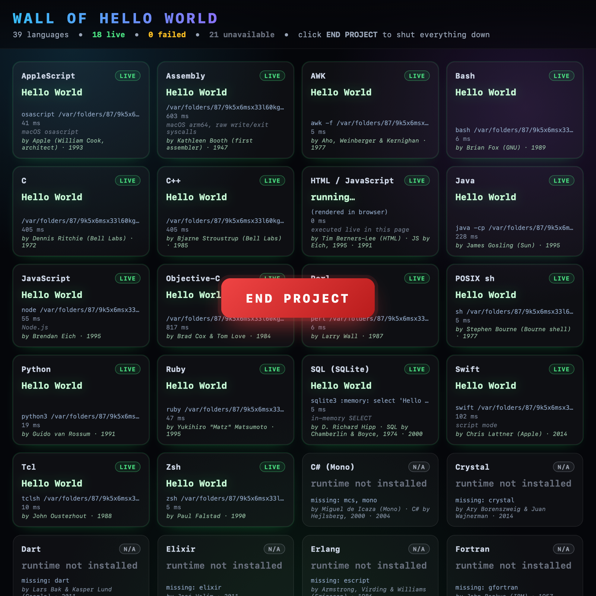

# Wall of Hello World

> A full-screen wall of 39 programming languages all saying the same simple
> thing — running for real on your own machine. One button in the centre. Click
> it and everything stops.

**By Daniel Bratcher · [@DanielDeveloped](https://github.com/DanielDeveloped)**
· MIT licensed · Python 3 · no third-party packages



---

## What this is

A small, honest demonstration. The controller runs each language's `Hello
World` program **once**, captures the output it actually produced, and shows
all the captured results together in a single full-screen page. Languages
whose runtime isn't installed are still shown — clearly marked
**runtime not installed** rather than faked. Click `END PROJECT` and the
whole thing shuts down: server gone, browser window gone, temp files gone,
nothing in the background.

It tries to support up to 39 languages out of the box. On a clean macOS with
just Xcode Command Line Tools and Node.js installed, around 18 light up green
immediately. Install more runtimes and more tiles go green — nothing else
needs to change.

---

## Why "Hello World"?

A short history, because this whole project is a love letter to it.

The phrase `hello, world` was first put in print as a programming example by
**Brian Kernighan** in his 1972 paper *"A Tutorial Introduction to the
Language B"* at Bell Labs. The form everyone now copies — a tiny C program
that just prints `hello, world\n` — was cemented in 1978 when Kernighan and
**Dennis Ritchie** published *The C Programming Language* (the book affectionately
known as "K&R"). Their very first example was a complete, runnable C program
that did nothing more than print those two words.

That tiny example became the universal rite of passage. Every time a developer
picks up a new language, the first thing they write is some flavour of
`Hello World`. Not because it's hard, but because it isn't:

- **It's a sanity check.** If `Hello World` runs, your toolchain works
  end-to-end — the editor, the file system, the interpreter or compiler,
  the runtime, the terminal. If it doesn't, the problem isn't your code.
- **It's a tradition.** A small, shared ritual that links every programmer
  across every language and decade.
- **It's a fair comparison.** It strips a language down to its surface
  syntax. You see exactly what "printing a line" looks like in that culture —
  `puts`, `println`, `echo`, `print`, `console.log`, `IO.puts`, `cat`, `Write-Output`.

So this project just… does that. All of them. At once. On one screen.

---

## Get it running — pick the path that matches you

There are three paths below. Pick whichever describes you most honestly.

### 🟢 Path A — "I have never opened a Terminal in my life"

You only need a Mac. No prior coding required. The whole thing uses Python,
which is already installed on macOS — you don't need to download anything.

1. Open the **Terminal** app. Easiest way: press `⌘` + `Space` to open Spotlight,
   type `Terminal`, press Return. A small black window opens with a blinking
   cursor. That's a terminal. Don't be intimidated — you're going to type
   four short lines.

2. Copy the line below, click into the Terminal window, paste it (press
   `⌘` + `V`), then press Return:
   ```
   cd ~/Downloads
   ```
   That tells the terminal "work inside my Downloads folder."

3. Now download this project. You can either:
   - **Easy:** go to this project's GitHub page in your web browser, click the
     green **Code** button, click **Download ZIP**, then double-click the
     downloaded file to unzip it. A folder called `hello-world-wall` (or
     `hello-world-wall-main`) appears in your Downloads.
   - **A bit fancier:** paste this into the Terminal and press Return:
     ```
     git clone https://github.com/DanielDeveloped/hello-world-wall.git
     ```
     (This only works if you have `git` installed. If you get a popup asking
     to install developer tools, click **Install** — that takes 5–10 minutes
     and only happens once.)

4. Tell the terminal to go into the project folder:
   ```
   cd hello-world-wall
   ```
   (If your folder is called `hello-world-wall-main`, use that instead.)

5. Run the wall:
   ```
   python3 run.py
   ```
   The terminal prints a small progress bar as it tests each language. After
   ~15 seconds your browser opens a dramatic dark page with a wall of `Hello
   World` tiles and a big red button in the middle.

6. **When you're done**, click the red **END PROJECT** button. The browser tab
   says "Demonstration ended" and the terminal goes quiet. You can close
   them both.

**That's it.** Nothing got installed permanently. Nothing is still running.

If your browser opened in a normal tab instead of true full-screen, press
`⌘` + `Ctrl` + `F` for the cinematic effect.

### 🟡 Path B — "I kind of know my way around a terminal"

```bash
git clone https://github.com/DanielDeveloped/hello-world-wall.git
cd hello-world-wall
python3 run.py
```

That's the whole story. No `pip install`, no virtualenv — pure standard
library. The browser opens automatically. Click **END PROJECT** to shut down.

To see how many languages will actually run live on your machine (without
running anything), try:
```bash
python3 run.py --list
```

The more language runtimes you have installed (`brew install go rust lua php
deno julia kotlin gfortran` etc.), the more tiles will turn green. You don't
have to install anything — missing ones just show as "runtime not installed",
which is honest and looks fine.

### 🔴 Path C — "I'm a developer"

```bash
python3 run.py [--no-open] [--dry-run] [--list] [--timeout 40]
```

| Flag | Behaviour |
|---|---|
| *(none)* | Probe runtimes, run available languages in parallel, render the wall, open it full-screen (Chrome `--app --start-fullscreen` if available, else default browser), block on `/exit`. |
| `--no-open` | Serve at `http://127.0.0.1:<ephemeral>/` and print the URL. `GET /exit` shuts it down. Handy for SSH/remote/headless. |
| `--dry-run` | Run the languages, print a colourised results table, exit. No server. Good for CI and laughing at how many "n/a" rows you have. |
| `--list` | Print every registered language plus availability, run nothing. |
| `--timeout SECS` | Override the default per-step timeout (default 25s). Compiled / JVM languages have per-language overrides on top. |

Architecture: see [How it works](#how-it-works) below and the [design answers](#design-answers).
Adding a language is one entry in `controller/languages.py` — no other file
changes.

---

## What the wall actually shows

| Status | Meaning |
|---|---|
| 🟢 **LIVE** | The runtime is installed; the program really ran on your machine and produced the displayed output. The tile shows the exact command and how long it took. |
| 🟡 **FAIL** | The runtime is installed but something went wrong (timeout, compile error, non-zero exit). The error message is shown — not hidden. |
| ⚪ **N/A** | The runtime isn't installed. The tile is dimmed and lists which executables were missing. The program was not run. |

Each tile also carries a small italic credit line — *by `<creator>`, `<year>`* —
so the wall doubles as a quiet history of programming.

---

## A nod to the people behind each language

Every one of these languages exists because somebody (often several somebodies)
spent years on it, frequently as unpaid evening work. In rough chronological
order:

| Year | Language | Created by |
|---:|---|---|
| 1947 | Assembly | **Kathleen Booth** — wrote what is generally regarded as the first assembly language, for the ARC2 computer. |
| 1957 | Fortran | **John Backus** & team at IBM — the first widely-used high-level language. |
| 1972 | C | **Dennis Ritchie** at Bell Labs — the language `Hello World` was born in (with Brian Kernighan). |
| 1974 | SQL | **Donald Chamberlin & Raymond Boyce** at IBM. |
| 1977 | AWK | **Alfred Aho, Peter Weinberger & Brian Kernighan** at Bell Labs. (Yes, that Kernighan again.) |
| 1977 | Bourne shell (POSIX sh) | **Stephen Bourne** at Bell Labs. |
| 1984 | Objective-C | **Brad Cox & Tom Love**. Later the bedrock of NeXT and early macOS/iOS. |
| 1985 | C++ | **Bjarne Stroustrup** at Bell Labs — started life as "C with Classes" in 1979. |
| 1986 | Erlang | **Joe Armstrong, Robert Virding & Mike Williams** at Ericsson. |
| 1987 | Perl | **Larry Wall**. |
| 1988 | Tcl | **John Ousterhout** at UC Berkeley. |
| 1989 | Bash | **Brian Fox** for GNU; later maintained by Chet Ramey. |
| 1990 | Haskell | The **Haskell Committee** (Simon Peyton Jones, Philip Wadler, Paul Hudak, John Hughes, and others). |
| 1990 | Zsh | **Paul Falstad** at Princeton. |
| 1991 | HTML | **Tim Berners-Lee** at CERN. |
| 1991 | Python | **Guido van Rossum**. |
| 1993 | AppleScript | **Apple**, architected by William Cook. |
| 1993 | Lua | **Roberto Ierusalimschy, Luiz Henrique de Figueiredo & Waldemar Celes** at PUC-Rio, Brazil. |
| 1993 | R | **Ross Ihaka & Robert Gentleman** at the University of Auckland. |
| 1994 | PHP | **Rasmus Lerdorf**. |
| 1995 | Java | **James Gosling** at Sun Microsystems. |
| 1995 | JavaScript | **Brendan Eich** at Netscape — written in roughly ten days. |
| 1995 | Ruby | **Yukihiro "Matz" Matsumoto**. |
| 2000 | C# | **Anders Hejlsberg** at Microsoft. |
| 2000 | SQLite | **D. Richard Hipp**. |
| 2003 | Groovy | **James Strachan** (later led by Guillaume Laforge). |
| 2004 | Mono | **Miguel de Icaza** — open implementation of .NET / C#. |
| 2004 | Scala | **Martin Odersky** at EPFL. |
| 2006 | PowerShell | **Jeffrey Snover** at Microsoft. |
| 2008 | Nim | **Andreas Rumpf**. |
| 2009 | Go | **Robert Griesemer, Rob Pike & Ken Thompson** at Google. |
| 2010 | Rust | **Graydon Hoare**, originally at Mozilla. |
| 2011 | Dart | **Lars Bak & Kasper Lund** at Google. |
| 2011 | Elixir | **José Valim**. |
| 2011 | Kotlin | **Andrey Breslav** and the JetBrains team. |
| 2012 | Julia | **Jeff Bezanson, Stefan Karpinski, Viral B. Shah & Alan Edelman** at MIT. |
| 2012 | TypeScript | **Anders Hejlsberg** at Microsoft (the C# architect again). |
| 2014 | Crystal | **Ary Borenszweig & Juan Wajnerman** at Manas Tech. |
| 2014 | Swift | **Chris Lattner** at Apple. |
| 2016 | Zig | **Andrew Kelley**. |
| 2018 | Deno | **Ryan Dahl** — also the creator of Node.js (2009). |

Special thanks go to **Brian Kernighan**, whose 1972 *Tutorial Introduction to
the Language B* and 1978 *The C Programming Language* (with Dennis Ritchie)
gave us the `hello, world` example this entire project celebrates.

If any attribution above is wrong or you'd prefer a different form of credit,
please open an issue or PR — these are meant as nods of respect, and accuracy
matters.

---

## How it works

```
 detect & run each language once  ─►  collect results  ─►  render one page
        (parallel, timed)               (in memory)         (served on localhost)
                                                                   │
   exit: kill browser, delete temp dir, stop server   ◄──  END PROJECT button
```

- **`controller/languages.py`** — the registry. One `Lang(...)` entry per
  language with its source code, build/run commands, required executables,
  per-language timeout, and historical credit.
- **`controller/runner.py`** — runs each language in its own private temp
  subdirectory, in its own process group (`start_new_session=True`), with a
  wall-clock timeout. On timeout the *entire* process group is killed with
  `os.killpg`, so no grandchild process can survive (important for things
  like `go run` which spawns the compiler then the binary).
- **`controller/server.py`** — a tiny `ThreadingHTTPServer` bound to
  `127.0.0.1` only. Two routes: `/` returns the page, `/exit` triggers a
  clean shutdown.
- **`controller/page.py`** — renders the captured results into one
  self-contained HTML page (no external CSS, no external JS, no network).
- **`run.py`** — orchestrates everything, opens the page in a browser
  (Chrome `--app --start-fullscreen` if found), installs `atexit` + signal
  handlers so cleanup runs even on `SIGTERM` / `SIGHUP` / `Ctrl+C`.

### Folder structure
```
hello-world-wall/
├── run.py                 # entry point / CLI / orchestration
├── README.md
├── LICENSE
├── docs/
│   └── screenshot.png
└── controller/
    ├── __init__.py
    ├── languages.py       # the registry (add a language = add an entry)
    ├── runner.py          # safe subprocess execution
    ├── server.py          # localhost server + /exit
    └── page.py            # full-screen page renderer
```

---

## Design answers

The original brief asked ten questions. Here they are, answered honestly.

1. **Is this possible?** Yes — it is built and verified. The honest limit
   is *which* languages run: only those whose runtime is installed. Missing
   runtimes show as dimmed "unavailable" tiles, never faked.
2. **Simplest architecture.** Three layers: a *runner* that runs each
   language once with a timeout and captures the output, a *collector* that
   gathers all results in memory, and a *display* layer that renders them
   into one HTML page and serves it on localhost.
3. **Best controller language.** Python. It's already on every Mac, has
   excellent subprocess and process-group control, ships an HTTP server in
   the standard library, and needs no third-party packages.
4. **Best display method.** A local browser-based full-screen page served
   from `127.0.0.1`. Dramatic, gives responsive grid layout for free, makes
   the centre button trivial, and the same page can signal the controller
   to exit.
5. **Languages to support first.** The almost-always-installed scripting and
   shell crowd (Python, JS, Ruby, Perl, Bash, Zsh, sh, AWK, Tcl,
   AppleScript, SQLite), and the C-family compilers that come free with
   Xcode CLT (C, C++, Objective-C, Swift), plus Java and arm64 Assembly.
6. **Stretch languages.** PHP, Lua, R, PowerShell, Go, Rust, TypeScript,
   Deno, Dart, Kotlin, Scala, Groovy, C#/Mono, Haskell, Julia, Elixir,
   Erlang, Crystal, Nim, Zig, Fortran. Install whichever you fancy and the
   tile lights up.
7. **How nothing is left running.** Every subprocess uses its own session
   so the whole process group can be killed on timeout; per-step wall-clock
   timeouts; one private temp dir cleaned up on exit; `atexit` + handlers
   for `SIGTERM` / `SIGHUP` / `Ctrl+C`; the HTTP server listens on localhost
   only and is shut down by `/exit`; the launched browser window is killed
   by process group (it runs in its own session with an isolated profile).
8. **Folder structure.** See above.
9. **Staged build plan.**
   1. Runner + registry for 3–4 always-present interpreters.
   2. Timeouts and process-group kills.
   3. Add the compiled C-family (C/C++/Obj-C/Swift) + Assembly.
   4. HTML grid + centre button; serve on localhost; open full-screen.
   5. Wire `/exit` → kill browser, delete temp, stop server, exit.
   6. Add the long tail of "run if installed" languages with honest fallback.
   7. Polish: parallel execution, terminal summary, signal/`atexit` safety
      net, historical credits on every tile.
10. **Risks and limitations.** Coverage depends on what's installed (this is
    honest, not a bug); Assembly is architecture-specific (arm64 and x86_64
    variants included, anything else fails honestly); first compiles of
    Swift/Java/Kotlin can be slow (hence per-language timeouts); in a
    non-script browser tab `window.close()` won't close the tab — the
    controller still exits and the page tells you it's safe to close;
    it only ever runs its own tiny fixed `Hello World` programs — it never
    executes untrusted or user-supplied code.

---

## Honesty

- This is a showcase project, designed and directed by Daniel Bratcher and
  built in collaboration with **Claude Code** (Anthropic's coding agent). The
  architecture, the registry-driven design, the choice to bake credit into
  the tiles, and every word of this README were chosen by the author; the
  agent's job was implementation and verification.
- Nothing is downloaded at runtime. Nothing leaves your machine. There is
  no telemetry. The server listens on `127.0.0.1` only.
- All language outputs shown on the wall are **captured from real
  executions** on the user's machine. Languages that did not run say so.
- Historical attributions in the credit table are presented in good faith
  from widely-available sources; corrections via issue/PR are welcome.

---

## Credits

- **Brian Kernighan** & **Dennis Ritchie** — for the `hello, world` tradition.
- Every language creator named in the [timeline above](#a-nod-to-the-people-behind-each-language).
- All the toolchain maintainers (gcc/clang, the JVM, Node, the GNU shells)
  whose binaries do the actual work when you click run.
- **Anthropic / Claude Code** — pair-programming tool used to build this.

---

## License

[MIT](LICENSE) © 2026 Daniel Bratcher (DanielDeveloped). Do what you want with
it; a credit back is appreciated but not required.
